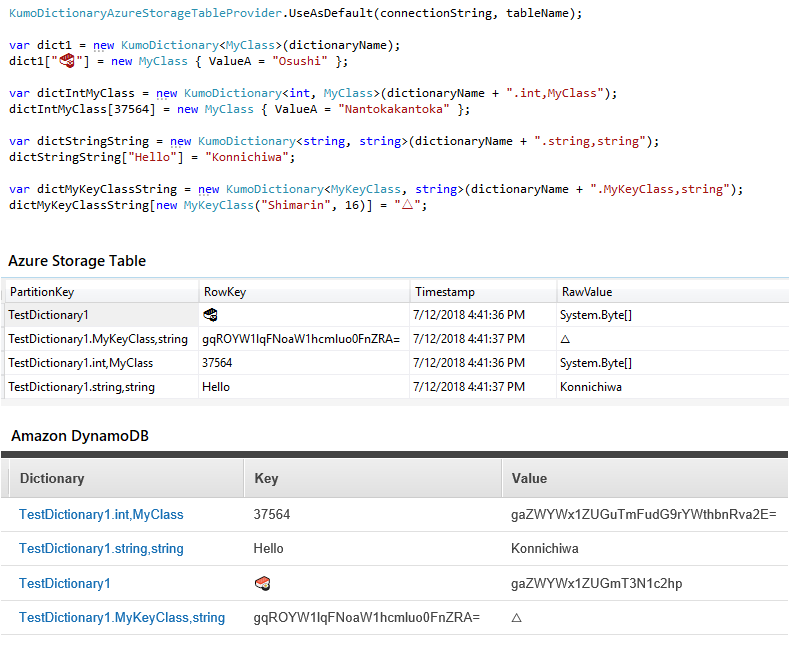

# KumoDictionary
KumoDictionary provides `IDictionary<TKey, TValue>` interface for access to a behind Key-Value-Store (e.g. Azure Storage Table, DynamoDB).

When you set a value to KumoDictionary, it serializes the value by [MessagePack](https://github.com/neuecc/MessagePack-CSharp/) and writes to Key-Value-Store transparently. It's easy setup and simple to use.



## 💡 Motivation
Serverless apps (Azure Functions, AWS Lambda ...) need to store a data sometimes. However, setting up and accessing a datastore is boring. KumoDictionary helps that.

When you need performance or scalability, you should design an app-specific table and data access patterns. KumoDictionary isn't aiming to do that.

## ⚙ Requirement
.NET Standard 2.0

## ✅ Supported functions and capabilities
- Supports Key-Value-Store backends
    - Microsoft Azure Storage Table
    - Amazon DynamoDB
- Supports serialization for complex types
    - MessagePack (Default) 
    - JSON (KumoDictionary.Serialization.Utf8Json)
- `IDictionary<TKey, TValue>` interface implementation
    - Indexer access (getter/setter)
    - `GetEnumerator` (`foreach` support)
    - `Add`, `Remove`, `TryGetValue`, `Clear`, `ContainsKey`, `Contains`
- Additional `*Async` methods

## ❌ Limitations / Not supported features
- High-scalability KVS table design and access
- Transaction
- `IDictionary<TKey, TValue>` interface implementation
    - `Count` property 
    - `ICollection<KeyValuePair<TKey, TValue>>.CopyTo` method

## ⚡ Quick Start
### Install NuGet Package

- KumoDictionary.AzureStorageTable
- KumoDictionary.AmazonDynamoDB

```sh
# Use Microsoft Azure Storage Table
$ dotnet add package KumoDictionary.AzureStorageTable

# Use Amazon DynamoDB
$ dotnet add package KumoDictionary.AmazonDynamoDB
```

### Create a DynamoDB table for KumoDictionary (Amazon DynamoDB only)

|Primary key|Key name|Key type|
| --- | --- | --- |
|Partition key|Dictionary|String|
|Sort key|Key|String|

> NOTE: If using KumoDictionary backend provider for Azure Storage Table, the backend creates a table when if not the table exists.

### Configure KumoDictionary backend provider as default provider.

Set KumoDictionary backend provider as a default provider at the entry point.

```csharp
// Set backend provider for Microsoft Azure Storage Table
var tableName = "MyTestTable";
var connectionString = "DefaultEndpointsProtocol=https;AccountName=...";

KumoDictionaryAzureStorageTableProvider.UseAsDefault(connectionString, tableName);


// Set backend provider for  Amazon DynamoDB
var tableName = "MyTestTable";
var dynamoDBClient = new AmazonDynamoDBClient();

KumoDictionaryAmazonDynamoDBProvider.UseAsDefault(tableName, dynamoDBClient);
```

### Create a instance of `KumoDictionary<TValue>` and set or get values.

Create a instace of `KumoDictionary<TValue>` class and you can use like a `IDictionary<string, TValue>` class!

```csharp
var dict = new KumoDictionary<MyClass>();
dict["key1"] = new MyClass { ValueA = 1234 };
dict["key2"] = new MyClass { ValueA = 5678 };

Console.WriteLine(dict["key1"].ValueA); // => 1234
```

## 📝 Best practice / Important note
### Using complex typed key carefully.
You can use complex type as a dictionary key(`TKey`). However, once a complex typed key is serialized, to add fields or properties to the type breaks compatibility.

For example:
```csharp
// Version 1
public class MyKey
{
    public int ValueA { get; set; }
}

var dict = new KumoDictionary<MyKey, int>("dictionaryName1");

dict[new MyKey { ValueA = 1 }] = 123;

Console.WriteLine(dict[new MyKey { ValueA = 1 }]); // => 123
```

```csharp
// Version 2
public class MyKey
{
    public int ValueA { get; set; }
    public int ValueB { get; set; } // add a new property!
}

var dict = new KumoDictionary<MyKey, int>("dictionaryName1");

Console.WriteLine(dict[new MyKey { ValueA = 1 }]); // => `KeyNotFoundException`
```

**We recommend using a primitive type (string, int, enum ...) for a dictionary key.**

### Get a value once, use it twice or more.
Always I/O access occurred when you get a value through a dictionary indexer. If you use the value multiple time in a statement, you should store the value.

```csharp
var dict = new KumoDictionary<int>("dictionaryName1");

// This statement generates network requests 2 times.
Console.WriteLine("{0}: {1}", dict["KeyA"].GetType(), dict["KeyA"].ToString());

// Recommend: You should store a value.
var value = dict["KeyA"];
Console.WriteLine("{0}: {1}", value.GetType(), value.ToString());

```

## License
MIT License